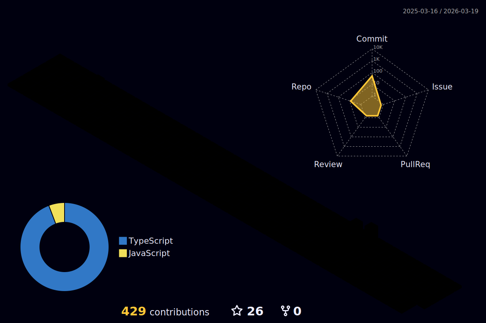

    

 
## Hi there, I'm Furkan Ulutaş 

   
### 👨🏻‍💻 &nbsp;About Me

- 🎓 I'm currently studying at Clarusway
- 🔭 I'm currently working to become a Full Stack Developer.
- 🌱 I’m currently learning Machine Learning, Deep Learning and Cyber Security.
- 💬 Ask me about HTML, CSS, JavaScript, PHP, PHP Moodle, PHP Mailer, MySQL, SQL Server, Python, Flask, Tkinter, WordPress, LimeSurvey, Moodle, OpenCart, Bootstrap, TypeScript, React.
- ⚡ Fun fact: I spend almost 12 hours listening songs everyday.

    
     
### 🛠 &nbsp;Tech Stack

- 💻 &nbsp;
  
  
  
- 🌐 &nbsp;
  
  
  
  
  
  
  
  
- 🛢 &nbsp;
  
  
- ⚙️ &nbsp;
  
  
  
- 🔧 &nbsp;
  
  
  
  
  
  
  
- 🖥 &nbsp;
  
  
 
 
  

<b>Github Stats :</b>
  

<a href="https://github.com/d4rkn3m3s1s">
  
  
  

 

  

   
   
  </a>
  

&nbsp;

 

### 📫 &nbsp;Contact with Me

  
  
  
  
   

  

  

  

             
             
             
            
 🌱 <b>Support:</b>
  

 

 
⭐️ From [d4rkn3m3s1s](https://github.com/d4rkn3m3s1s)

